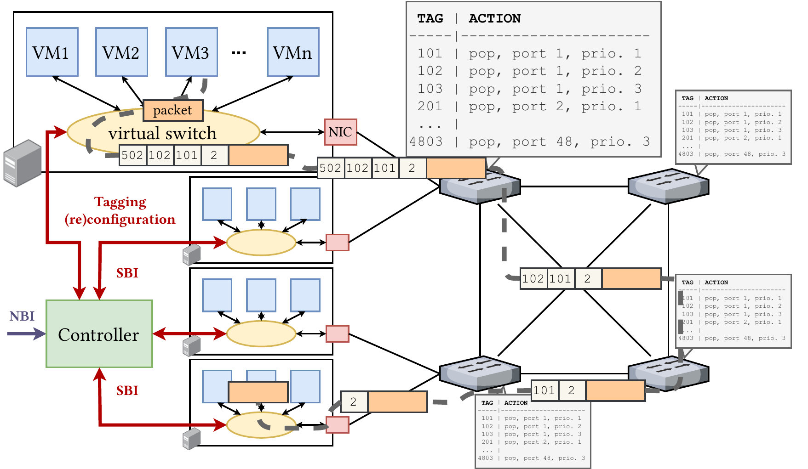
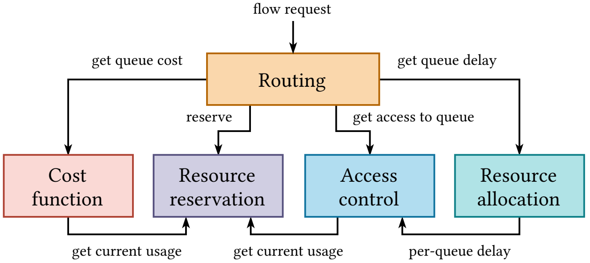
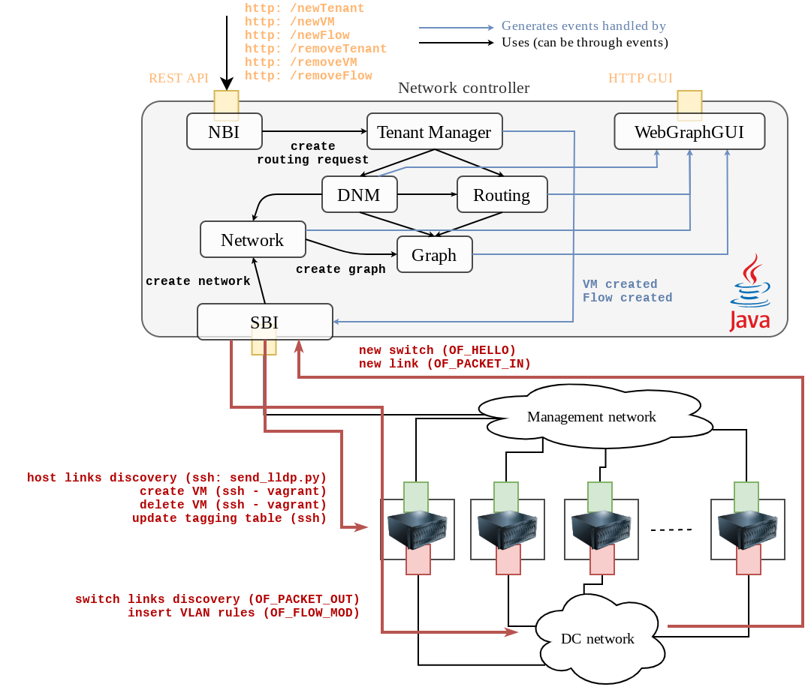

# Chameleon: network controller

This repository contains the reference implementation of the network controller of the **Chameleon** networking system for predictable latency in programmable networks published in:
- [Amaury Van Bemten, Nemanja Ðerić, Amir Varasteh, Stefan Schmid, Carmen Mas-Machuca, Andreas Blenk, and Wolfgang Kellerer. "Chameleon: Predictable Latency and High Utilization with Queue-Aware and Adaptive Source Routing." ACM CoNEXT, 2020](https://mediatum.ub.tum.de/doc/1577772/file.pdf).

This project does not contain the main logic of the controller, but rather aggregates all the logic of its constituting components.
This is described in the [implementation architecture section](#implementation) below.

## Chameleon

Chameleon relies on source routing for providing predictable latency in programmable networks.
Servers (i.e., end hosts) run virtual machines (VMs) that wish to communicate with each other over a shared network.

Packets sent by VMs are captured in a virtual switch that is responsible for tagging (with VLAN tags) and shaping flows.
The tags the virtual switch adds correspond to the successive actions the switches in the network must take when they receive the packet.
Each time a switch receives a packet, it outputs it to a particular output port and queue based on the outermost VLAN tag and pops the latter.

The switches are configured at the startup of the network with static rules: a particular outermost VLAN tag corresponds to a particular output port and queue.
The configuration of a new flow simply requires to update the tagging rules in the virtual switch of the source VM.

The network controller is the entity responsible for, based on a user request for a new flow, computing a path in the network that satisfies the end-to-end delay requirement of the flow.
The controller must also ensure that this new flow will not lead to previous flows seeing their guarantees being violated.

More details about the architecture, the implementation, the goal, and the performance of Chameleon can be found in the [2020 CoNEXT article](https://mediatum.ub.tum.de/doc/1577772/file.pdf) where the system was originally published.
Section 3 focuses on the design of the system, with Section 3.5 focusing on the architecture of the controller.
Section 4.1 details the implementation of the control part.

## Controller Architecture

### Logic

The network controller logic is divided into 5 components.

Delays are assigned to each queue by a **resource allocation** algorithm.
A **cost function** assigns a cost metric to each queue based on the state of the network.
A **routing component**, which receives flow requests, uses these delay and cost values to find a path in the network that satisfies the delay requirement of the new flow and minimizes the cost metric. 
The state of the network is managed by a **resource reservation** component, which updates the usage of the network when the routing component registers a new flow.
The routing procedure relies on an **access control** component to check whether a flow can be embedded in a given queue without violating the per-queue delay assigned by the resource allocation algorithm.
The routing component is also responsible for rerouting flows if that is necessary to embed the new flow.

### Implementation

The network controller of *Chameleon* is implemented in Java and consists of 8 modules, which are all based on the [ECES core](https://github.com/AmoVanB/eces-graph) library.
This core library implements an *entity-component event-based* (ECES) multi-threaded system.
Classes are organized as components that attach to entities, and listener methods can be configured to asynchronously be called upon the creation/deletion/update of selected components.The different modules use this framework to communicate with each other.

- The [graph](https://github.com/AmoVanB/eces-graph) module implements a graph library on top of the core system. Graph, nodes, and edges are components.
- The [network](https://github.com/AmoVanB/eces-network) module implements a network structure on top of the graph. A network is represented as two graphs: a link-level graph and a queue-level graph (each link is duplicated `n` times, where `n` is the number of queues at this link - see Section 3.3 of the [Chameleon paper](https://mediatum.ub.tum.de/doc/1577772/file.pdf) for more details on that). Network nodes, links, schedulers, and hosts are components that can be created.
- The [DNM](https://github.com/AmoVanB/eces-dnm) module implements the *cost function*, *resource reservation*, *access control*, and *resource allocation* components described [above](#logic). It holds all the mathematical logic to compute delay bounds in the network. The module exposes, for each queue, a `getCost` method to get the cost of using that queue, a `getDelay` method to get the delay allocated to that queue, a `hasAccess` method to check whether a new flow can be embedded in that queue without violating the delay allocated to the queue, and a `register` method to update the state of the queue to take into account a new flow. Changing the configuration of this module allows to switch from the Chameleon model to the [QJump](https://www.usenix.org/system/files/conference/nsdi15/nsdi15-paper-grosvenor.pdf) and [Silo](https://people.eecs.berkeley.edu/~justine/silo_final.pdf) models. See the [DNM repository](https://github.com/AmoVanB/eces-dnm) for more details.
- The [routing](https://github.com/AmoVanB/eces-routing) module implements routing algorithms that find paths in a graph. When a routing request is attached to an entity, a response is automatically attached by the routing system to the same entity. Routing algorithms interface with graphs using so-called proxies to compute cost and delay values and to perform access control and resource reservation. The [DNM](https://github.com/AmoVanB/eces-dnm) module implements the proxies that are used by the Chameleon controller.
- The [tenant manager](https://github.com/AmoVanB/eces-tenant-manager) module introduces the concepts of tenants, virtual machines (VMs), and flows. The module allows to create tenants, to add VMs, and to embed flows between VMs. Tenants and VMs are logical concepts within the module. When a flow gets created, the module creates a routing request that is solved by the routing module. The tenant manager also implements the rerouting strategy described in Section 3.4 and 4.1.3 of the [Chameleon paper](https://mediatum.ub.tum.de/doc/1577772/file.pdf).
- The [SBI](https://github.com/AmoVanB/eces-sbi) module implements switch discovery (using OpenFlow 1.0), topology discovery (using LLDP), and configures switches and end hosts. The module creates the discovered topology in the network module. When the tenant manager creates a VM, the module spins up that VM in the corresponding server using SSH. When the tenant manager creates attaches a flow to an entity after having used the routing module to find a route for it, the SBI module automatically configures the appropriate tagging and shaping rules in the virtual switch of the source server for the packets to be routed on the physical links and queues that the routing module chose.
- The [NBI](https://github.com/AmoVanB/eces-nbi) module implements a REST API for allowing applications to request flow embeddings. The module simply translates REST calls into operations in the tenant manager.
- The [WebGraphGUI](https://github.com/AmoVanB/eces-webgraphgui) module implements a GUI which allows to visualize the graphs created by the network module. The GUI also displays information about the components of other modules that are attached to the same entity as the graph elements. For example, the GUI allows to see which flows are embedded on which queue. The GUI also implements coloring of the edges to display, e.g., the number of flows embedded at each queue.

The code of these 8 libraries is available in their respective repositories.
The repository here instantiates and connects the 8 modules together to form the network controller of Chameleon.

## How to Use and Contribute

The controller can only use the versions of the modules we pushed on the Maven central repository.
If you wish to use a modified version of one of the modules (e.g., to add your switch in the [SwitchCapabilities](https://github.com/AmoVanB/eces-sbi/blob/master/src/main/java/de/tum/ei/lkn/eces/sbi/SwitchCapabilities.java) of the [SBI](https://github.com/AmoVanB/eces-sbi) module) you can either:
- Propose a pull request on the `develop` branch of the module you want to modify. We will rapidly create new versions (that are pushed on Maven central) for new features.
- Fork the module you want to modify and upload yourself the modified artifact to a Maven repository of your choice.
- Remove the dependency for the module you want to modify in the [pom.xml](./pom.xml) file and copy the code of the module in the [src](./src) directory of this repository. Your modified module will then be compiled directly with the controller.
